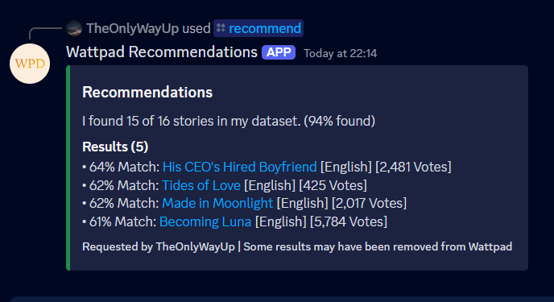

WattpadRecommendations
---
Starspace-based recommendation model based on List co-occurrence for Wattpad stories.

Example output when given Wattpad's [Reading Radar](https://www.wattpad.com/featured/551324301) list as a User's preferences. Give it any Wattpad list URL to search for stories you'd like, based on the ones in the list.


## How it works
When given a Wattpad List URL, the Bot fetches all the stories in that list. It cross-references with Qdrant (vector database) to discover how many of those stories have been indexed. It uses indexed stories to search for similarities based on the model generated by Starspace.

This isn't semantic similarity, which is how close in meaning two stories are - Rather, stories are grouped based on the types of Users that like them.

If User A likes stories 1, 2, and 3, and User B has read 1 and 2, the Bot will recommend Story 3 to them too.

This is a tried and true approach!


## Resources
- [Starspace](https://ai.meta.com/tools/starspace/)
- [Typesense Recommendation Documentation](https://typesense.org/docs/guide/recommendations.html#step-3-train-starspace-model)
- [Qdrant Recommendation Documentation](https://qdrant.tech/documentation/concepts/explore/#recommendation-api)

## Steps
1. Clone Starship to the project directory and `cd` into it (`git clone https://github.com/facebookresearch/Starspace.git\ncd Starspace`)
2. Install and extract boost (`curl -LO https://boostorg.jfrog.io/artifactory/main/release/1.82.0/source/boost_1_82_0.tar.gz && tar -xzvf boost_1_82_0.tar.gz`)
3. Build boost (`make -e BOOST_DIR=boost_1_82_0 && \\n  make embed_doc -e BOOST_DIR=boost_1_82_0`)
4. Train starspace
```
./starspace train \
    -trainFile ../src/sids.txt \
    -model wpaRecModel \
    -label '' \
    -trainMode 1 \
    -epoch 25 \
    -dim 100
```

`sids.txt` is in the format,
```
6501 7212 17445 20412 36197 ...
23153 38792 47922 73234 91986 ...
84307 87217 89794 105872 ...
```

Each line represents a List on Wattpad, containing space seperated IDs of the stories they contain. Generated using [test.ipynb](./src/test.ipynb).

5. Build `embed_doc` (`make embed_doc && chmod +x ./embed_doc`)
6. Generate a file with one story id per line (script in [test.ipynb](./src/test.ipynb))
7. Pass to `embed_doc` (`./embed_doc wpaRecModel ../src/story_ids.txt > embeddings`)
8. Move generated embeddings file to `src` directory
9. The next step requires a Qdrant instance, please make sure you have one running with the GRPC port forwarded.
10. Run parsing script in [test.ipynb](./src/test.ipynb)
11. The embeddings have been synced to Qdrant!
12. You need a Redis instance for the next step, please make sure you have one running.
13. You can now serve the embeddings using the Discord bot! (`python3 main.py`)

## Discord Bot
The discord bot has a `/recommend` command, you can give it a List URL for it to base recommmendations off of.

By default, these results are cached for 12 hours. If you've added or removed stories from your list, you can trigger a cache break using the `refresh:True` option.

For example, `/recommend list_url:https://www.wattpad.com/featured/551324301 refresh:True`

---

<div align="center">
    <p>TheOnlyWayUp © 2024</p>
</div>